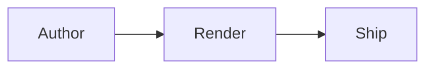
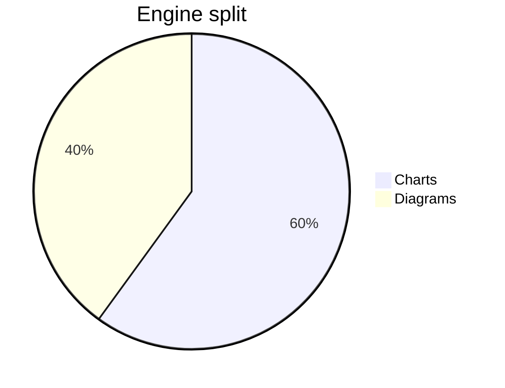

# Live Post

This post is published, so it shows in the listing and the RSS feed.

## Browser checked article

The default post layout renders this body below the generated article header.

The RSS body keeps [a root link](/about/) and an inline image.


A Swift code fence stays static but receives build-time token colors:

```swift
struct ReleaseNote {
    let title: String
    let shipped = true
    let priority = 1

    func summary() -> String {
        "TileDown highlights code at build time"
    }
}
```

:::tile embed
url: https://www.youtube.com/watch?v=dQw4w9WgXcQ
title: TileDown demo video
aspectRatio: 16/9
:::

:::mermaid
graph TD
  A[Write Markdown] --> B[Build TileDown]
  B --> C[Ship static HTML]
:::

:::chart
type: bar
title: Release metrics
labels: Jan, Feb, Mar
series.Downloads: 12, 19, 7
series.Stars: 3, 8, 5
:::

A static chart authored as a Markdown fence, using the same notation as
MarkdownPDF:

```chart
type: line
title: Fenced adoption
categories: Q1, Q2, Q3
x-label: quarter
y-label: signups
series: Signups = 4, 9, 14
```

A scatter chart with true `(x, y)` points:

```chart
type: scatter
title: Effort versus impact
x-label: effort
y-label: impact
series: Trials = (1, 2), (3, 5), (6, 9)
```

A diagram authored as a Markdown fence, using MarkdownPDF's notation:



A mermaid pie renders as a static chart, like MarkdownPDF:


