# Tiledown

**Project website: [tiledown.com](https://tiledown.com/)**

**Follow updates on [@diyamantina](https://x.com/diyamantina).**


A Swift static site generator with a Markdown-canonical source format and a typed
tile model. Authors write a constrained Markdown profile; the parser turns it into
a tree of typed tiles, which render to static HTML, CSS, and (for interactive
tiles) browser JavaScript. The engine library is `TileKit`, the CLI is `tiledown`.

> The repository is named `tile-down`; the product and CLI are `tiledown`.

## What it renders

Ordinary Markdown becomes a themed page: headings, lists, GitHub-flavored tables,
code, and blockquotes laid out by a built-in theme, with math typeset to SVG right
alongside the prose. The same page in light and dark (the image follows your
GitHub theme):

<p align="center">
  <picture>
    <source media="(prefers-color-scheme: dark)" srcset="docs/images/page-dark.png">
    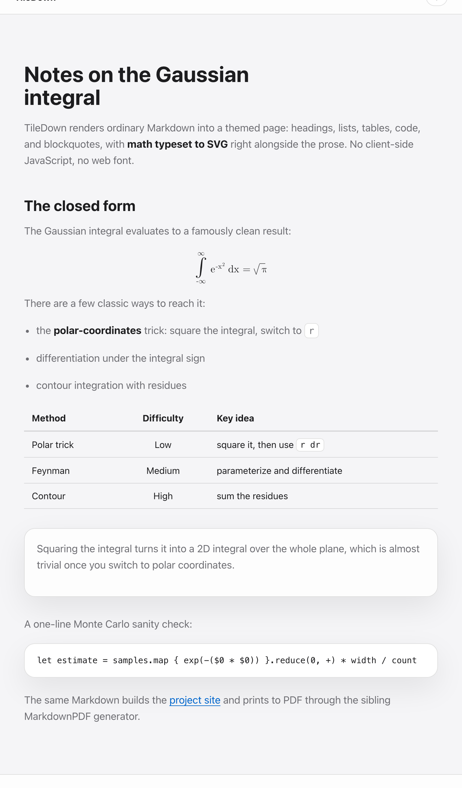
  </picture>
</p>

The pieces below are written in Markdown and rendered by the build. Math and charts
come out as static SVG with no client-side JavaScript and no web font; mermaid
diagrams use the mermaid runtime.

### Math

A `$$...$$` block is typeset to a self-contained SVG of real glyph outlines, themed
with `currentColor`, with a hidden MathML companion for accessibility.

```tex
$$\frac{-b \pm \sqrt{b^2 - 4ac}}{2a}$$
```

<p align="center">
  
  &nbsp;&nbsp;&nbsp;
  
</p>

### Charts

A fenced `chart` block becomes a static SVG chart (bar, line, scatter, doughnut)
with no chart library and no runtime.

```chart
type: bar
title: Developer happiness by static site generator
categories: TileDown, Hugo, Jekyll, Bespoke PHP
y-label: happy devs (%)
series: This year = 92, 71, 64, 12
```

<p align="center">
  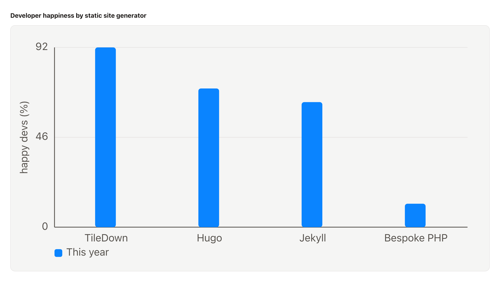
</p>

### Graphs and diagrams

A fenced `mermaid` block renders a graph through the mermaid runtime; a `pie` block
renders as a static SVG chart, matching the sibling MarkdownPDF project.

<p align="center">
  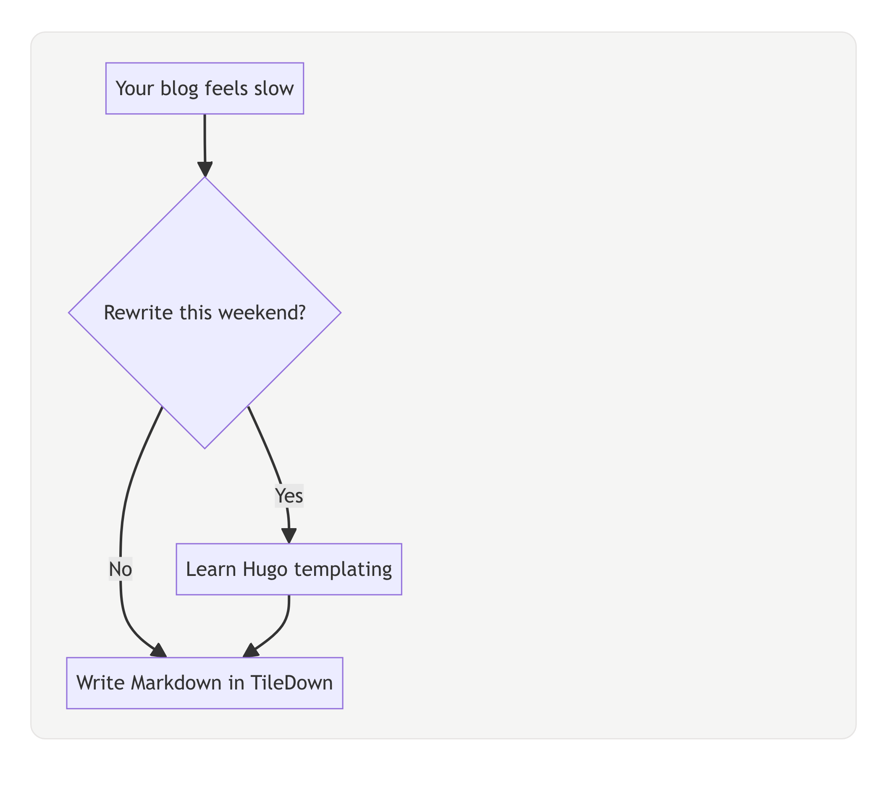
</p>

## Status: pre-1.0, and already powering a live site

Tiledown is at version `0.3.0`, and it already builds and deploys its own project
website, [tiledown.com](https://tiledown.com/), from this engine on every change.
It is usable today for static content sites like that one. It is pre-1.0, so the
toolchain and some APIs can still change; pin a commit if you need a stable
toolchain.

What works today is a real, growing slice. The engine builds, and the CLI can
build a single Markdown file through a Mustache-style template, or build a folder
of `index.md` files into a styled site using a built-in layout and theme selected
from `tiledown.yml`. It can also emit derived JSON of the parsed tile tree
(`tiledown json`) and rewrite a document to its canonical form (`tiledown fmt`).
Markdown is real CommonMark via
[swift-markdown](https://github.com/apple/swift-markdown). The compatibility
target is CommonMark plus GitHub Flavored Markdown tables and images. Display math
written as `$$...$$` is typeset at build time to self-contained SVG, with no
client-side JavaScript and no web font (see Math below). Tile CSS is wrapped in
CSS cascade layers and deduplicated into one shared site stylesheet, site-wide
configuration reaches templates as `site.*`, and configured content builds can
write an RSS feed from the shared post collection. The CLI also has a local
preview server through `tiledown serve`. Built-in tile rendering is wired for
`callout`, `counter`, `embed`, `chart`, `mermaid`, and `service-form`. A
`service-form` tile can load a local service contract declared in `tiledown.yml`.

Still missing before it is production-ready: project scaffolding (`tiledown init`),
watch mode, action tiles such as `poll`, comments, and email-response, runtime
proxy support for deployed service calls, and a full asset pipeline (transforms,
minification). Service contracts can be read from local files at build time; HTTP
contract loading, health checks, and production proxy hosting are still future
work.

The architecture and the planned road are real and written down:

- [docs/DESIGN.md](docs/DESIGN.md) - design, goals, and current-state snapshot.
- [docs/NEXT_STEPS.md](docs/NEXT_STEPS.md) - the ordered work queue.
- [docs/decisions/](docs/decisions/) - accepted architecture decisions.
- [docs/research/](docs/research/) - the research behind the source-model pivot.

## What actually runs today

The live demo at [tiledown.com](https://tiledown.com/) is built from this
repository's engine and the same `tiledown build-site` command shown below.

From `Packages/`:

```sh
swift run tiledown version
# Tiledown 0.3.0
```

Build one page from Markdown and a template:

```sh
# source.md
# ---
# title: Hello
# ---
# # Welcome
#
# This is a page.

# template.html
# <!doctype html><title>{{ page.title }}</title>{{{ page.contents.html }}}

swift run tiledown build source.md template.html out.html
```

Build a content directory with the built-in top-nav layout and standard theme
(each `index.md` becomes a slugged `index.html`, and a shared `styles.css` is
written once for the whole site):

```sh
swift run tiledown build-site content/ dist/
```

Build and preview a content directory on localhost:

```sh
swift run tiledown serve --port 8765 content/
```

`serve` writes to a sibling `.tiledown/serve/` directory by default. Pass
`--output dist/` when you want a stable preview output path.

### Math

Write a formula in a display block and the build typesets it to a self-contained
SVG. There is no MathJax, no math runtime, and no web font: the glyphs are real
outlines extracted from the bundled Latin Modern Math font in pure Swift, the fill
is `currentColor` so it follows light and dark themes, and a hidden MathML copy
travels with each formula for accessibility.

```markdown
The quadratic formula:

$$\frac{-b \pm \sqrt{b^2 - 4ac}}{2a}$$
```

```sh
swift run tiledown build-site content/ dist/
# dist/.../index.html now contains an <svg> of glyph <path> outlines, no <script>
```

That `$$...$$` block renders to:

<p align="center">
  
</p>

The typesetting engine is the standalone, dependency-free
[MathTypeset](https://github.com/mihaelamj/MathTypeset) package, shared with the
[MarkdownPDF](https://github.com/mihaelamj/MarkdownPDF) generator so the same TeX
source typesets to the same shapes whether the target is a web page or a PDF.
Tiledown supports a TeX subset; display (`$$...$$`) math is in, inline `$...$` is
next. Live example: [tiledown.com/posts/math-in-markdown](https://tiledown.com/posts/math-in-markdown/).

Add `content/tiledown.yml` to select site settings:

```yaml
title: Minimal Site
baseURL: https://example.com
layout: top-nav
theme: system
theme.light.accent: #0057d8
theme.dark.accent: #66aaff
rss: true
rssPath: feed.xml
shareLinks: true
notFoundRedirect.exact./old-post: /posts/new-post/
notFoundRedirect.prefix./tag/: /tags/
social.github: https://github.com/TileDown/tile-down
social.linkedin: https://www.linkedin.com/
```

Theme property overrides use the curated `--td-*` custom property surface. For
example, `theme.light.accent` rewrites `--td-accent` in light mode and
`theme.dark.accent` rewrites it in dark mode, so built-in layouts and themed
tiles reskin together.

When `shareLinks: true` is set, built-in article pages include static share links
for X, LinkedIn, Facebook, and email. Set `baseURL` for absolute share URLs on a
published site.

Declare local service contracts for `service-form` tiles in `tiledown.yml`:

```yaml
service.calculator.contract: contracts/calculator.json
service.calculator.mode: proxy
service.calculator.proxyRoute: /_td/services/calculator
```

Then use the service id from Markdown:

```markdown
:::tile service-form
id: price-calculator
service: calculator
operation: positive-decimal-calculation
mode: proxy
submitLabel: Calculate
:::
```

The contract file is consumed by the build and is not copied into the generated
site output.

Fallback 404 redirects help migrated static sites preserve old URLs on hosts
without wildcard redirect files. `notFoundRedirect.exact.<path>` redirects one
legacy path, while `notFoundRedirect.prefix.<path>` redirects any path beginning
with that prefix. Sources must be root-relative paths. Targets can be
root-relative paths or HTTPS URLs. Query strings and fragments are preserved, and
the most specific matching prefix wins.

Posts can declare tags in front matter:

```markdown
---
title: Notes from the renderer
type: blog-post
date: 2026-05-31
tags: swift, rendering
---
```

`type: blog-post` and `type: post` select the built-in article behavior.
`type: page` and unknown explicit values use the standard page behavior.
Dated pages under `postsDir` still act as posts when `type:` is omitted.

Tiledown generates static tag pages. Single-tag pages keep `/tags/swift/`.
Two-tag AND filters are always generated, and larger filters use canonical nested
URLs such as `/tags/rendering/swift/testing/` when those tags co-occur on a post.
Higher-order generated filters are capped at three selected tags so a densely
tagged post cannot expand to every possible tag subset.
Custom tag bars should render only `site.tags` items with `isVisibleInTagBar` on
multi-tag pages; the built-in layouts already do this.

Pages can set a hero image in front matter. Add `imageDark` when a screenshot or
diagram needs a separate dark-mode asset:

```markdown
---
title: Demo
image: /assets/demo-light.png
imageDark: /assets/demo-dark.png
---
```

Built-in layouts use the same pair for post-card thumbnails. If `imageDark` is
omitted, the generated page keeps the plain single-image markup.
When `baseURL` is set, root-relative generated `src` and `href` values such as
`/assets/demo-light.png` are prefixed with that base URL. Authored relative URLs
such as `assets/demo-light.png` remain relative.

Built-in layouts also use page front matter and site configuration for head
metadata. Set `description` for the description, Open Graph, and Twitter
description tags. Set `baseURL` for canonical URLs, Open Graph URLs, and
absolute social preview images. Dated posts under the posts directory emit
article metadata.

Or pass a custom template explicitly:

```sh
swift run tiledown build-site content/ template.html dist/
```

Emit derived JSON of the parsed tile tree, or rewrite a document to canonical form:

```sh
swift run tiledown json source.md out.json
swift run tiledown fmt source.md            # prints canonical form to stdout
swift run tiledown fmt --write source.md    # rewrites in place
swift run tiledown fmt --check source.md    # non-zero exit if not canonical
```

That is the user-facing surface right now. Markdown is CommonMark (headings,
paragraphs, emphasis, strong, inline and fenced code, links, images, lists, block
quotes), with raw HTML escaped; templates are a Mustache-style subset.

See [Examples/minimal-site](Examples/minimal-site) for a small site with home,
about, contact, three posts, footer social links, the `system` theme, and RSS.

## Roadmap

The public issue tracker is organized into epics. These diagrams include every
open public issue as of June 2, 2026.

Status key. The roadmap status colors move with the work: open issue, active
branch, review PR, then merged.

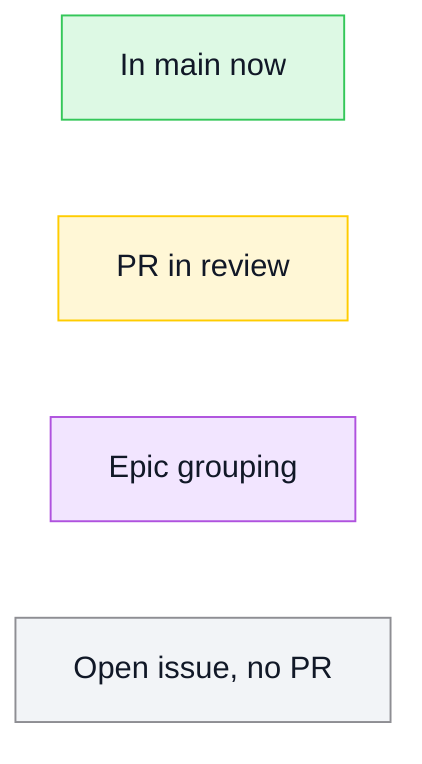

### Current shipped slice

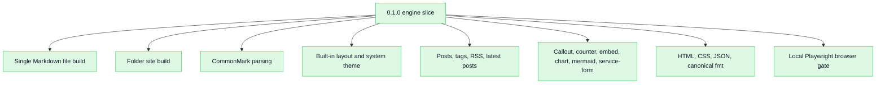

### Roadmap by epic

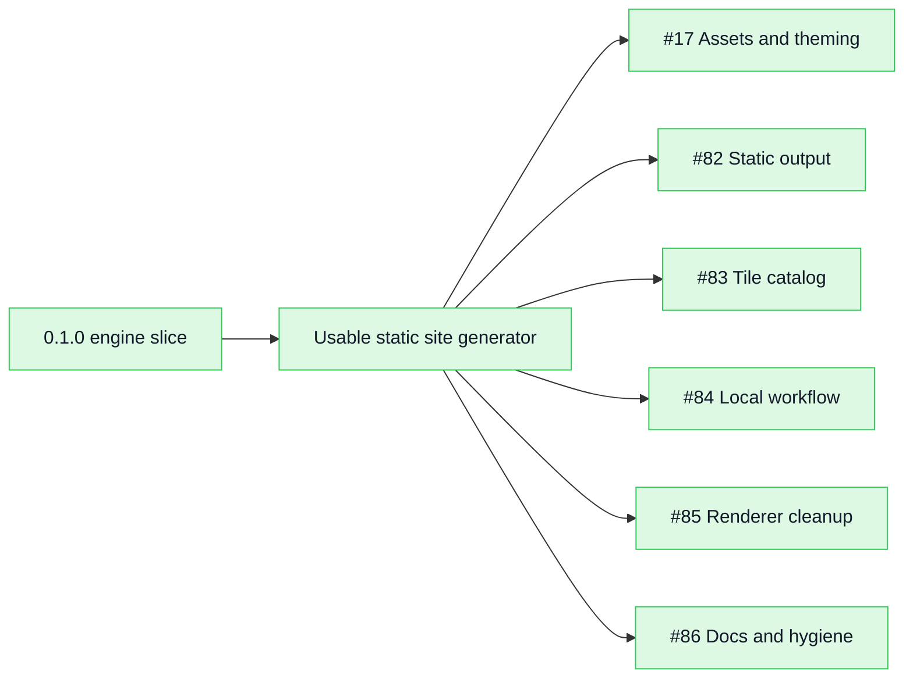

### #17 Assets and theming

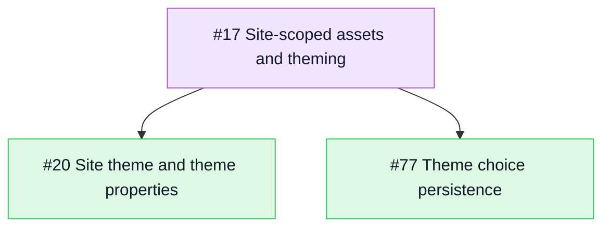

### #82 Static output

```mermaid
flowchart TD
  Epic["#82 Launch-ready static output"]:::epic
  Epic --> Static["#79 Static passthrough"]:::done
  Epic --> Types["#49 Content types"]:::done
  Epic --> Redirects["#45 Redirect output"]:::done
  Epic --> NotFound["#47 404 page"]:::done
  Epic --> Sitemap["#46 sitemap.xml"]:::done
  Epic --> RSS["#78 RSS content:encoded"]:::done
  Epic --> BaseURL["#37 baseURL asset links"]:::done
  Epic --> Slugs["#87 Migration slugs"]:::done
  Epic --> LegacyRedirects["#97 404 legacy redirects"]:::done
  Epic --> SEO["#100 SEO metadata"]:::done
  Epic --> HeroFM["#103 Hero front matter"]:::done

  classDef done fill:#ddf9e4,stroke:#34c759,color:#111827
  classDef review fill:#fff7d6,stroke:#ffcc00,color:#111827
  classDef epic fill:#f2e5ff,stroke:#af52de,color:#111827
  classDef todo fill:#f2f4f7,stroke:#8e8e93,color:#111827
```

### #83 Tile catalog

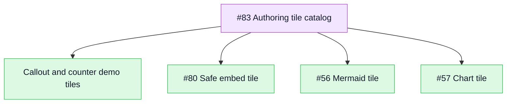

### #84 Local workflow

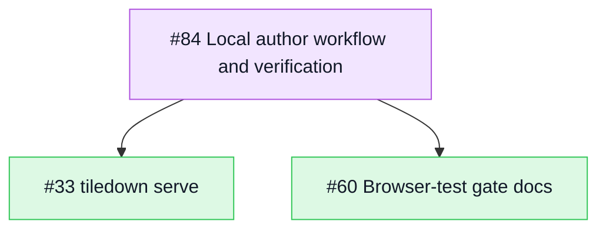

### #85 Renderer cleanup

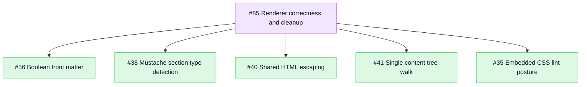

### #86 Docs and hygiene

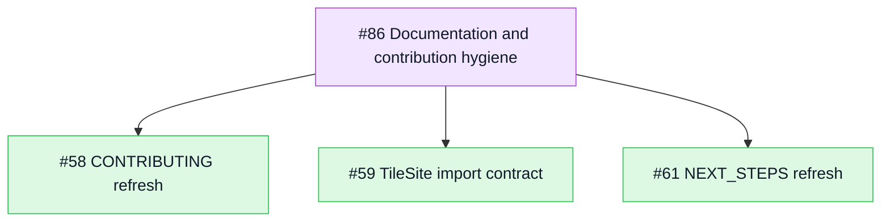

## Build and test

```sh
cd Packages
swift build
swift test
```

The engine targets macOS and Linux. To build and test on Linux, see
[docs/linux-testing.md](docs/linux-testing.md).

The full local verification stack is:

```sh
scripts/check-local.sh
```

It runs style checks, namespacing checks, SwiftFormat in lint mode, SwiftLint,
`swift build`, `swift test`, and the local Playwright browser gate.
The same browser fixture runs on Linux in the GitHub workflow.

For generated-site behavior that needs a real browser, such as computed styles,
image decoding, client-side tile JavaScript, and the theme toggle, run the local
Playwright gate from the repo root:

```sh
Packages/Tests/Browser/run.sh
```

That script builds the browser fixture site, serves it locally, and drives
Chromium through Playwright. It requires Python Playwright and Chromium; see
[Packages/Tests/Browser](Packages/Tests/Browser).

## Project conventions

Swift only, except JavaScript emitted as browser runtime for client-side tiles.
Dependencies injected through initializers, types namespaced under `TileKit`, one
type per file. See [AGENTS.md](AGENTS.md) and [docs/rules/](docs/rules/) for the
full conventions, and [CONTRIBUTING.md](CONTRIBUTING.md) to contribute.

## License

[AGPL-3.0](LICENSE).
