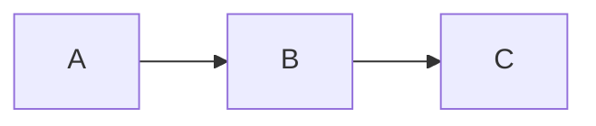

# Authoring content

A Tiledown site is a tree of Markdown files under `content/`. Each page is a folder
with an `index.md` inside it. The folder layout mirrors your URLs:

```
content/
  index.md            -> /
  about/index.md      -> /about/
  blog/index.md       -> /blog/   (the post listing)
  blog/hello/index.md -> /blog/hello/
```

Every `index.md` has two parts: a front matter block between `---` fences, and the
Markdown body below it.

```markdown
---
title: Hello
date: 2026-06-03
---

# Hello

This is the body. Plain Markdown.
```

For the full Markdown and tile syntax (tables, embeds, charts, math, escaping), see
[markdown-profile.md](markdown-profile.md). This page covers front matter and the
content directives you place in the body.

## Front matter

Front matter is a list of `key: value` lines. All fields are optional unless your
layout needs them.

| Field | Type | Used for |
| --- | --- | --- |
| `title` | string | Page heading and `<title>`. |
| `description` | string | Meta description and social cards. |
| `slug` | string | The published URL path, taken verbatim. See [Slugs](#slugs). |
| `date` | date | Post date. Drives ordering and the feed. |
| `draft` | boolean | `true` keeps the page out of normal builds. See [Drafts](#drafts). |
| `image` | path | Hero/social image, for example `/images/blog/post/hero.jpg`. |
| `imageDark` | path | Alternate hero image for dark mode. |
| `tags` | list | Comma-separated tags, for example `Swift, OpenAPI`. |
| `kicker` | string | Small eyebrow line shown above the title. |
| `weight` | number | Manual ordering hint where a list supports it. |

### Slugs

If you set `slug`, that exact value is the URL path. Tiledown does not re-slugify
your title or infer a different path. This is how you keep a URL stable.

```markdown
---
slug: blog/cupertino
title: "Cupertino: Offline Apple Documentation for AI Agents"
---
```

publishes at `/blog/cupertino/`, regardless of the title or the folder name.

If you omit `slug`, the path is derived from the file's location under `content/`.
Setting `slug` explicitly is the reliable choice when a URL must not change, for
example when migrating an existing site. The slug is the full path from the site
root, so include the section: `slug: blog/my-post`, not `slug: my-post`.

### Drafts

A page with `draft: true` is skipped by `build-site` and `serve`. Pass `--drafts`
to include them when you want to preview work in progress:

```sh
swift run tiledown serve content --drafts
```

## Pages versus posts

Any page inside the posts directory (set by `postsDir` in
[tiledown.yml](config-reference.md#posts)) is a post: it is dated, listed, and
included in the RSS feed. Everything else is a standalone page.

The posts directory's own `index.md` is the listing page. Mark it with
`postList: true`:

```markdown
---
title: Blog
postList: true
---
# Blog
```

The home page can show the most recent posts with `latest: true` in its front
matter, combined with the `:::recent:::` directive in the body (below).

## Content directives

Directives are blocks fenced by `:::`. They render to tiles: typed components with
HTML, scoped CSS, and optional browser behavior. The general form is:

```
:::tile <kind>
property: value
:::
```

Some common tiles also have a shorthand directive.

### Recent posts

Drop the latest posts into any page. The count comes from `latestPosts` in
[tiledown.yml](config-reference.md#posts).

```
:::recent:::
```

### Callout

A titled note box.

```
:::tile callout
title: Heads up
body: This is worth reading twice.
:::
```

`title` defaults to "Note" if omitted.

### Counter

A button that counts clicks in the browser, with no network. Multiple counters on
one page are independent.

```
:::tile counter
label: Count me
:::
```

`label` defaults to "Clicks".

### Embed

Embed a video or other external content responsively.

```
:::tile embed
url: https://www.youtube.com/watch?v=dQw4w9WgXcQ
title: Demo video
aspectRatio: 16/9
:::
```

`url` is required. `title` and `aspectRatio` are optional.

### Charts and diagrams

Charts and Mermaid diagrams are written as fenced code blocks, with `chart` or
`mermaid` as the language, the same way MarkdownPDF does it:

````markdown
```chart
type: bar
title: Glyph coverage by script
x-label: Script
y-label: Glyphs covered
categories: Latin, Cyrillic, Greek
series: DejaVu = 220, 96, 84
series: Liberation = 210, 92, 80
```
````

````markdown

````

Chart keys: `type` (`bar`, `line`, `pie`, `doughnut`, `scatter`), `title`,
`x-label`, `y-label`, `categories` (the axis labels), and one or more
`series: Name = v1, v2, ...` lines. Pie and doughnut charts take `slice: Label =
value` entries or a single value series. Charts render to static SVG with no
browser JavaScript. The Mermaid fence renders the diagram with a pinned
client-side runtime, loaded only on pages that use it.

This is the same chart and diagram syntax as MarkdownPDF, so a document moves
between the two engines unchanged.

### Math

Inline and display math use TeX syntax and render to SVG glyph outlines, with no
client-side JavaScript. See [markdown-profile.md](markdown-profile.md) for the
details.

## See also

- [getting-started.md](getting-started.md) - build and preview a site.
- [config-reference.md](config-reference.md) - every `tiledown.yml` key.
- [markdown-profile.md](markdown-profile.md) - full Markdown and tile syntax.
